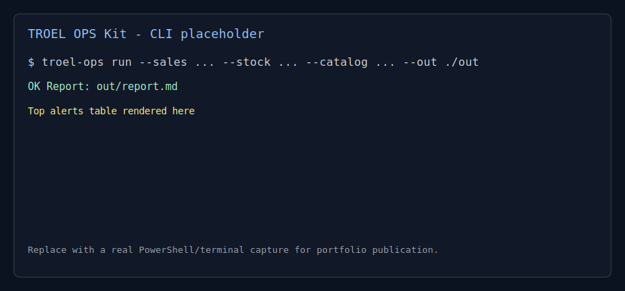
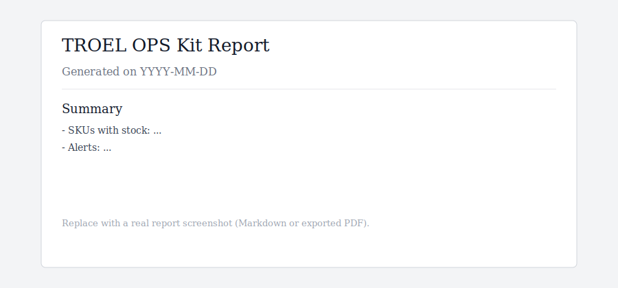

# TROEL OPS Kit


Pragmatic Supply Chain toolkit for **ingest -> validate -> KPI -> alerts -> report** using only synthetic demo data.

## Recruiter Quick Read
- Read in 2 minutes: [docs/RECRUITER.md](docs/RECRUITER.md)
- Architecture overview: [docs/ARCHITECTURE.md](docs/ARCHITECTURE.md)
- Synthetic business case: [docs/CASE_STUDY.md](docs/CASE_STUDY.md)

## Why this project exists
`TROEL OPS Kit` is a portfolio-grade CLI that demonstrates how to operationalize supply/stock analytics without over-engineering.

- Explainable and auditable business rules
- Clean Python packaging + CLI + CI
- Windows-friendly commands (PowerShell compatible)
- No client data, only synthetic datasets

## Quick demo (5 min)

```bash
python -m venv .venv
# Linux/macOS
source .venv/bin/activate
# Windows PowerShell
# .venv\Scripts\Activate.ps1

pip install -e ".[dev]"

troel-ops demo generate --out ./data/demo
troel-ops run --sales ./data/demo/sales.csv --stock ./data/demo/stock.csv --catalog ./data/demo/catalog.csv --out ./out
troel-ops report --in-dir ./out --format md
```

## Expected outputs
After `troel-ops run`, the `./out` folder contains:
- `issues.csv`
- `kpi_coverage.csv`
- `kpi_dormant.csv`
- `kpi_abc.csv`
- `alerts.csv`
- `report.md`

## Screenshots (placeholders)



## Architecture in 1 minute
```text
CSV/XLSX exports
    |
    v
[ingest + column mapping]
    |
    v
[validation contracts + cross checks]
    |
    v
[KPI engine: coverage / dormant / ABC]
    |
    v
[alert rules: explainable thresholds]
    |
    v
[report.md (+ optional PDF)]
```

## What this repo intentionally does NOT include
- Real client datasets or proprietary business rules
- Opaque AI scoring or black-box recommendations
- Heavy orchestration frameworks for a simple portfolio workflow

## CLI summary
- `troel-ops demo generate` -> creates synthetic datasets
- `troel-ops run` -> full pipeline and report generation
- `troel-ops report --format pdf` -> optional PDF conversion (`pip install -e ".[pdf]"`)

## Roadmap
- Add optional DuckDB materialization for intermediate tables
- Add scenario simulation (`what-if` coverage thresholds)
- Publish sample GitHub release with frozen demo artifacts

## License
MIT - see [LICENSE](LICENSE)
